# Experimental Tool Mondays: Facial Motion Capture
### An [Imaginary Spaces](imgspc.com) Blog Series

Hey! Alexis here again, Technical Artist at Imaginary Spaces where I work on tools and demo content for cutting edge game engine features.

## Facing the Problem

For many real-time artists, facial animation is where the character animation pipeline starts to complexify to sometimes close-to-unmanageable levels. While it's pretty easy in this day and age to get a bunch of humanoid animation off of sites like Mixamo and retarget them in your engine of choice, facial animation pipelines are often things that vary highly per-project. Will you animate your character at runtime like Oculus does with their avatars? Will you bake highly complex deformations into a bunch of Alembic files you'll play during your cutscenes? Maybe you can just go the time-proven, versatile way and have a nice clean rig with a bunch of bones and blendshapes - but like everything else written above, that'll require long hours to set up... and then on top of that you'll obviously have to spend even more hours authoring all the facial animation you need!

Can you have your facial animation cake and eat it too? Not really, honestly. Unless you're going for a really generic-looking bald guy, you're probably going to have to author your rig yourself and then spend a bunch of time animating it. All is not lost, however. breaking things down into smaller tasks, it's possible to identify where we can save time and optimize our pipeline. So really, what do we want out of our facial animation system?

With animation tools and facial recognition software alike, the specifics of a given face are often outlined as a series of points, known as facial landmarks, positionally related to each other - These often include upper and lower lips, eyebrows, etc.

By comparing the offset of these points from a neutral face, it's possible to feed in a bunch of data to various animation systems: how wide is my smile? Am I furrowing my eyebrows? all this information is often computed as either positional data or just simple values and can then be sent right into the system of your choice - as I wrote earlier, usually in a rig composed of a mix of bones and blend shapes.

Knowing what features you need animated in your face and with what amount of fidelity, you can then better plan your own facial rig "checklist" and not overengineer the system you eventually devise.

After you create your rig and have it properly set up to author a whole bunch of animation, you then need to organize yourself to be able to churn out everything you need.

And this is where this article really comes in. Short of manually keying everything, what are the options when it comes to animating your face? After spending a bunch of time authoring a pretty complicated rig, it only sounds fair that you could author at least a first pass of your animations without having to do everything by hand.

## So What Now?

For the purposes of this article, I put together an absurd little demo project showcasing a bunch of methods you can use to animate faces with various Open-Source tools foraged online or developed by yours truly. At most, you’ll need any old webcam, a Kinect or a bunch of coloured stickers from the dollar store!

Our demo features various denizens of a restroom freaking out because someone isn’t  washing their hands after going to the loo. Who knew you could experiment while remaining topical? Anyhow - let’s head into it head-first!

## Marker-Based Animation

Alright, here’s what you’ll need for the first experiment: a webcam and a bunch of coloured stickers from the dollar store!

[image](images/image2.png)

Before diving into anything more complicated I wanted to take a look at a more traditional motion capture method: marker-based tracking! The idea of trying to cobble something of the sort together had been trotting through my head for a while now so I’m glad this little facial tracking bonanza is what pushed me to do it!

After an hour or two of looking at how webcam textures work in Unity I managed to cobble this little thing together: it finds points on the rendered webcam texture that match various preset coloured markers and automatically moves assigned in-scene game objects. sounds useful?

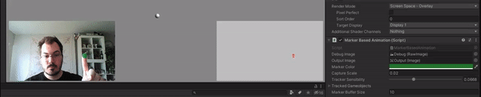

Kinda. This is obviously an extremely rough version of what much more realized marker animation tools can do - but it’ll do for now. In our little demo scene, we’ll use this method to animate the faces of our electrical plugs - Inside of Maya, we represent these faces with an incredibly simple rig - two bones for the eyes and one to deform  the mouth.

Recording in the engine, it ends up a little noisy and kind of humiliating. Ultimately this is of little concern as we can refine the result in Maya afterwards. If you’re wondering how I got an FBX out of it, I used the FBX Recorder that we developed at Imaginary Spaces in partnership with Unity!

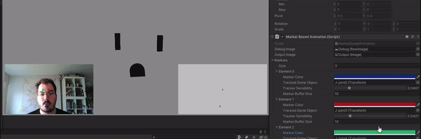

After some denoising in Maya it becomes a little more palatable. I won’t win any awards at SIGGRAPH for my marker capture tool but it’s serviceable for our plugs. With that done, we stick what we have into the engine and move onto the next experiment!

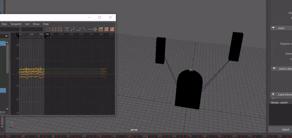

## Audio-Based Facial Animation

Holding off from more complicated methods again, I decided to then explore another simple technique for facial animation: audio-based animation! Think about it:

In many instances , the most important part of facial animation is getting the mouth to move properly when a character is talking - when working on something more stylized, everything else can pretty much be semi-random  (eg. blinking).

What happens when you talk? You output a mix of pitch and volume.

Based on that, here’s what I model in Maya and import into Unity: a super simple mouth composed of two blendshapes: one for pitch and one for volume!

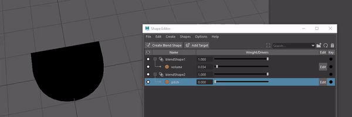

After a little audio analysis trickery (thanks, [aldonaletto](https://answers.unity.com/questions/157940/getoutputdata-and-getspectrumdata-they-represent-t.html)!) we’re able to get pitch and volume estimates at runtime in-engine and affect the two blendshapes of our mouth model - now all that’s left is sticking everything in a Unity Timeline and we’re good to go! Good to note here is that I used [smoothdamp](https://docs.unity3d.com/ScriptReference/Vector3.SmoothDamp.html) to smooth out the quite noisy analysis results to save me from going back  to Maya to denoise the animation like I had to with the plug faces!

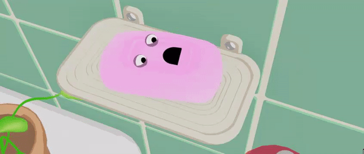

This method obviously won't cut it for every situation and specifically for parts of the face that aren't moving in relation to sound - blinking here, for instance, is handled by a separate script that just does it semi-randomly. Ultimately it's as I wrote earlier: depending on your facial animation requirements you can get by with surprisingly little.

## EmguCV / OpenCV

Complexifying things a little, let's head into the next experiment: OpenCV,  a much more comprehensive (and open-source) computer vision solution. From the horse’s mouth:

OpenCV (Open Source Computer Vision Library) is an open source computer vision and machine learning software library. OpenCV was built to provide a common infrastructure for computer vision applications and to accelerate the use of machine perception in commercial products. 

For our purposes, we’re using its (also Open-Source) C# wrapper EmguCV. Out of the box, OpenCV has an extensive face recognition module that can recognize up to sixty-eight facial landmarks on the face! Super impressive, especially considering that we can just use any old  webcam out of the box. [Looking at how they’re organized](https://www.researchgate.net/figure/The-ibug-68-facial-landmark-points-mark-up_fig9_327500528), it’s pretty interesting to see how you could very well cherry pick relevant landmarks and create a more stable version of something that works akin to our earlier marker-based demo.

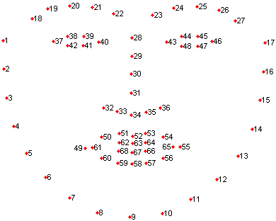

Anyways, the stock EmguCV for Unity release unfortunately had no face landmark recognition sample whatsoever and thus I had to fight with the thing for a few hours to get it to work (thanks, StackOverflow!). Once done, this is where I ended up:

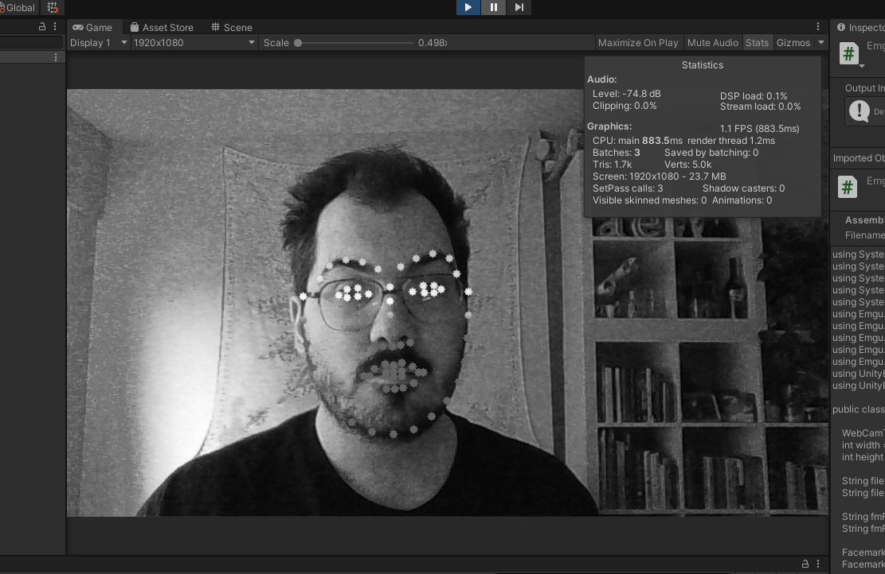

Success? Success! Kinda. While I do get excellent landmark tracking, it’s currently running at one frame per second with all the nasty texture operations I’m doing inside of Unity to get the webcam texture data up to OpenCV. I only had imparted so much time to visit all possible options so I decided that while it looked like the most promising option of the bunch, an Open-Source EmguCV facial animator for Unity would definitely need more involved work to be usable in any production context. For now, here’s the [slow-but-functional repo](https://github.com/alexismorin/EmguCV-Facial-Landmarks-for-Unity) for your perusing pleasure.

## Kinect Face Tracking API

Ever since I experimented with [Kinect Motion Capture](https://imaginary-spaces.com/experimental-tool-mondays-kinect-motion-capture/) the thing has been hanging out on my desk. Incredibly cheap and easy to find online, in your local classifieds or in a shoebox at the back of your closet,  the Kinect can’t seem to fade into oblivion and remains useful literally a decade after its release. The Kinect can output two 640×480 textures:

A run of the mill color map, A.K.A what you would get out of a generic webcam.
A surprisingly good depth map!

With the depth map (and the robust associated Kinect SDK codebase) comes a trove of good things like the ability to create world-scale geometry, animate full humanoid characters and most importantly for us, detect and track a myriad of facial landmarks at runtime!

With a bunch of Open-Source Unity integrations available to us, I ended up picking [what seemed like the best one](https://github.com/rfilkov/kinect2-unity-example-with-ms-sdk) and went off into the deep end. With a complex bone-based mouth and eyebrows, the last character of the sample project is definitely the most complex one.

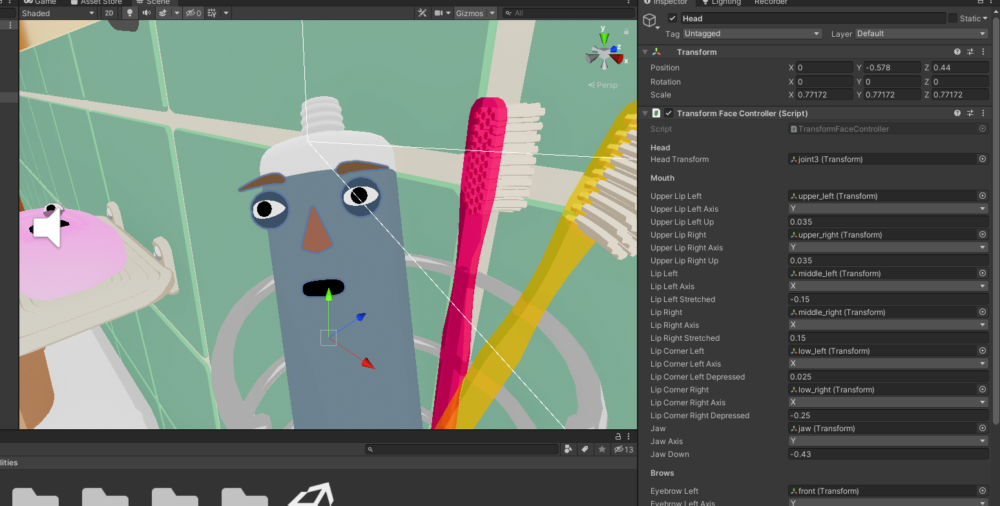

Riffing on previous themes, the Kinect face tracking API takes all detected facial landmarks and converts them to [Action Units](https://imotions.com/blog/facial-action-coding-system/), values essentially representing various muscle groups of the face that can be combined to form expressions. Taking the system for a test-drive, it performs surprisingly well. Always impressive to see how eyebrows add so much personality!

Depending on the system you authored and if you’re recording animation in-engine, it’s always helpful to remember that you can always combine various techniques for your final product. Not being able to get eyelid tracking to work properly, I had to animate the eyes via script - and that’s fine! Again, refer to the facial feature requirement checklist you planned out before freaking out that you can’t get millimeter-close accuracy for some facial expressions.

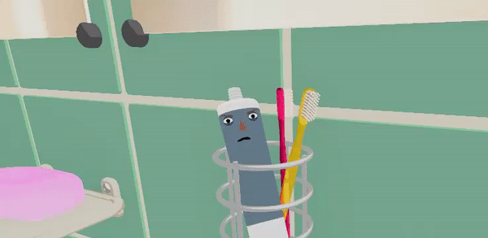

Anyways - Ready to capture my grimaces, I again use the Unity FBX recorder functionality and bake out the toothpaste character animation into something I can send to the Unity timeline. With that done, all characters of our scene are animated and after a little polish and audio work the [demo is complete](https://youtu.be/JudkkWIi_Zw)!

## A Little Extra Hand-Waving

Now that we’re done with the facial animation, let’s add hands that shake off water in the sink. For that I had the idea to use the new Oculus Quest hand tracking feature that came out semi-recently. After a few minutes of setting up a new project using my template project, I just exported some gesticulating into an alembic file, optimized it in Maya, reimported it back into Unity and that was it! It was surprisingly uncomplicated.

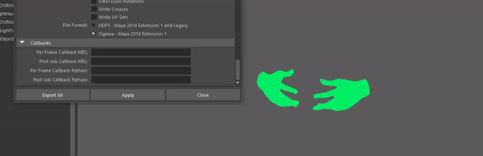

After the full integration process, I can safely say that while it won’t cut it for every use case, this simple Oculus-To-Alembic process is more than serviceable for cartoony stuff like this demo!

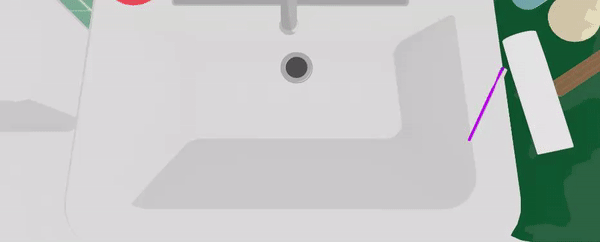

## FACS Animation and Other Options

A bunch of other options not mentioned in the article that will get you similar results are available. A technique I’d particularly like to try would be [FACS-based Animation](https://github.com/NumesSanguis/FACSvatar) that also uses the Action Units mentioned above, but this time sourcing data from a simple webcam instead of a depth camera - you can thank machine learning for that!

As time goes by (and as Microsoft sells more Azure kits) we’ll be seeing more and more interesting tools of the sort in the future. I’d definitely be interested to go back and wrap up some EmguCV animation tool in the future!

You can find the full sample project with code [here](https://github.com/alexismorin/Experimental-Tool-Mondays-Facial-Motion-Capture). Happy grimacing!

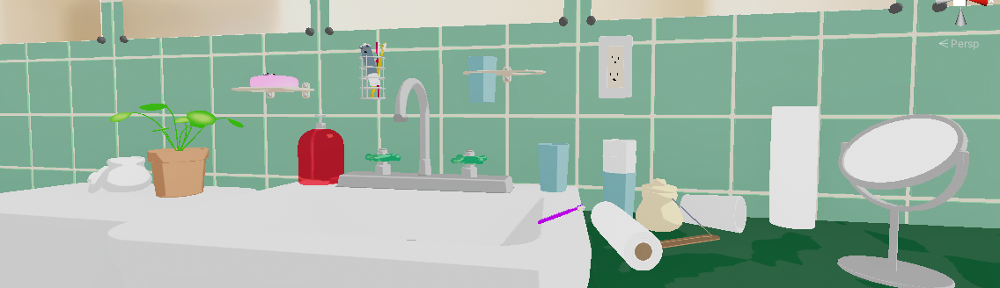

